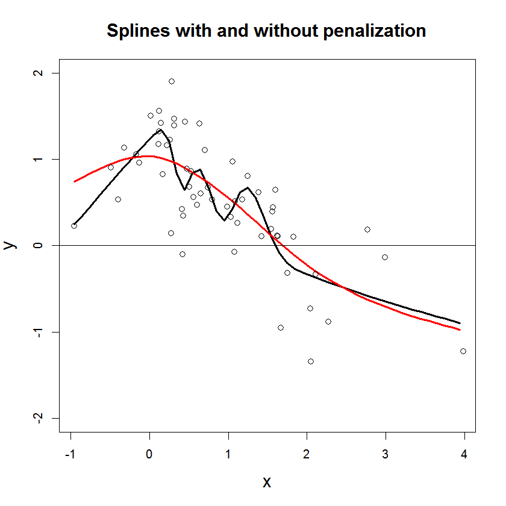

```{r echo=FALSE, eval=TRUE, results='hide',include=FALSE}
library(RTMB)
library(mgcv)
library(Matrix)
source("utils.R")
source("pSplines.R")
```


## **GAM model based on P-splines**
In this example you learn:

* How to estimate a model with P-splines (penalized splines) in RTMB.
* How to set up the spline part of the model in the `mgcv` package. 
* How to extract standard errors of a spline in RTMB.

***
#### Description of the practical situation
Let $Y$ be the biodiversity, as given by the variable `Richness` in the data. We assume that $Y \sim N(\mu,\sigma^2)$, were 
\begin{equation}
\mu = \beta_0 +  f_1(rock) +f_2(litter) + f_3(soil) + f_4(fallPrec) + f_5(sprTmax).
\end{equation}
Here, $f_1,\ldots,f_5$ are splines, modelled as function of covariates `rock`, `litter`,... (see data excerpt below).
See page 63 in Zuur (2009) for a similar example with use of the same data.
<details> <summary> "Penalizing the splines": how to get an appropriate level of smoothness?</summary>
We let the coefficients ($\beta$) of the $i$th spline have a multivariate normal distribution with precision matrix $\lambda_i \pmb{S}_i$, where $\lambda_i$ is a penalization parameter and $\pmb{S}_i$ is a penalization matrix extracted from the R-package `mgcv`. The matrices $\pmb{S}_i$ are singular, and hence the multivariate normal distributions are degenerate. However, when bringing in data through the likelihood, the (posterior) precission matrix becomes non-singular. See [Wood (2017)](https://books.google.no/books?id=JTkkDwAAQBAJ&printsec=frontcover&dq=generalized+additive+models+wood+2017&hl=no&sa=X&ved=0ahUKEwjp4o2sicHbAhWEFZoKHaHYBQ0Q6AEIJzAA#v=onepage&q=generalized%20additive%20models%20wood%202017&f=false) for details.
Implementation details are given in under the section "R code step-by-step" below.

```{r,echo=FALSE, comment="",fig.cap="Figure: Illustration of estimated splines with (red) and without (black) the penalization.", out.width = "300px"}

```


</details>

<details> <summary>Data excerpt</summary>
```{r,echo=FALSE, comment=""}
head(Vegetation,5)
```
</details>

***

#### Full code for example
<details> <summary> R code</summary>
```{r,echo=FALSE, comment=""}
include_source("pSplines.R", linesToInclud=c(1:999))
```
</details>

***


#### R code step-by-step
<details>  
  <summary>Include libraries</summary>
```r
  library(RTMB)
  library(mgcv) #Use gam
  library(Matrix) #Use sparse matrices
```
</details>
<details>  
  <summary>Read data</summary>
```r
  Vegetation <- read.table(file = "Vegetation.txt", header = TRUE, dec = ".")
  Vegetation = Vegetation[!is.na(Vegetation$Richness),]
```
</details>
<details>  
  <summary>Set up spline structure by using `mgcv`</summary>
```r
  gam_setup = gam(Richness ~ s(ROCK, bs = "cs") +
        s(LITTER, bs = "cs") + s(BARESOIL, bs = "cs") +
        s(FallPrec, bs = "cs") + s(SprTmax, bs = "cs"),
      data = Vegetation,fit=FALSE)
```
* `fit=FALSE` is because you only want `mgcv` to set up the spline bases,
   not fit the model.
</details>
<details>  
  <summary>Extract penalization matrices and combine them in a sparse block diagonal matrix</summary>
```r
  S_ROCK = gam_setup$smooth[[1]]$S[[1]]
  S_LITTER = gam_setup$smooth[[2]]$S[[1]]
  S_BARESOIL = gam_setup$smooth[[3]]$S[[1]]
  S_FallPrec = gam_setup$smooth[[4]]$S[[1]]
  S_SprTmax = gam_setup$smooth[[5]]$S[[1]]
  S_list = list(S_ROCK,S_LITTER,S_BARESOIL,S_FallPrec,S_SprTmax)
  S_combined = .bdiag(S_list)         # join S's in sparse matrix
  Sdims = unlist(lapply(S_list,nrow)) # Find dimension of each S
```
</details>
<details>  
  <summary>Construct the data list which is given to RTMB</summary>
```r
data = list(Y = Vegetation$Richness, # Response
            X = gam_setup$X[,-1],  # Design matrix, without intercept
            S = S_combined,      # Combined penalty matrix
            Sdims = Sdims)
```
</details>
<details>  
  <summary>Construct the parameter list with initial values which is given to RTMB</summary>
```r
  par = list(
    beta0 = 0,  # Intercept
    beta = rep(0,sum(Sdims)),  # Spline coefficients
    log_lambda = rep(rep(0,length(Sdims))), #Log spline penalization coefficients
    log_sigma = 0
  )
```
</details>
<details>  
  <summary>Implement negative log-likelihood</summary>
```r
  f = function(par){
    getAll(par,data)
      
    sigma = exp(log_sigma);
    lambda = exp(log_lambda);
    nll=0;
    k=1;  
    for(i in 1:length(Sdims)){
      m_i = Sdims[i]
      beta_i = beta[k:(k+m_i-1)]; #Recover betai
      S_i = S[k:(k+m_i-1),k:(k+m_i-1)]#Recover Si
      nll = nll- (0.5*m_i*log_lambda[i] - 0.5*lambda[i]*t(beta_i)%*% S_i  %*%beta_i);
      k = k+ m_i;
    }
    mu = beta0 + X%*%beta;
    nll = nll- sum(dnorm(Y, mu, sigma, TRUE));
    
    splineForReport = designMatrixForReport%*%beta;
    ADREPORT(splineForReport);
    ADREPORT(beta);
    return(nll)
  }
```
</details>


<details>  
  <summary>Fit the model</summary>
```r
  obj = RTMB::MakeADFun(f, par,random="beta", silent = TRUE)
  opt = nlminb(obj$par,obj$fn,obj$gr)
  sdrep = sdreport(obj)
```
</details>


***
#### Extra

1. Verify you get approximately the same results using the mgcv package.
  <details>
    <summary>Solution</summary>
    ```{r, fig.height=7, fig.width=7}
        source("pSplines.R")
    ```
</details>
